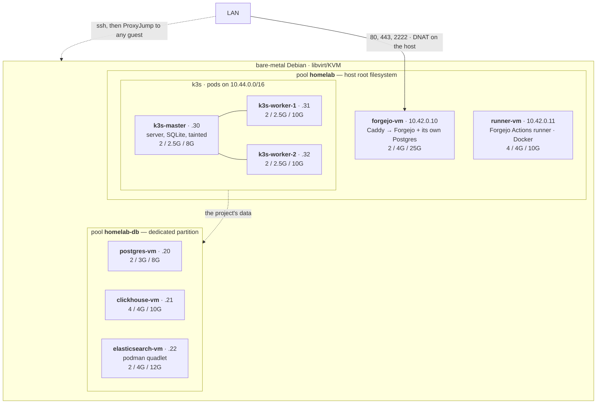
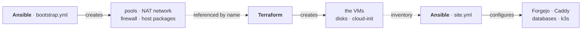

# clever-homelab

Terraform builds VMs on a bare-metal Debian/KVM host, Ansible configures them.
Guests: Forgejo behind Caddy at `git.homelab.lan`, its Actions runner,
PostgreSQL, ClickHouse, Elasticsearch, and a k3s cluster (one server, two
agents).

## Infrastructure

One bare-metal Debian box runs libvirt/KVM and nothing else — everything else is
a VM built from the Debian cloud image. Labels below read `vCPU / RAM / disk`;
disks are thin, so those are ceilings, not what is allocated today.



All guests share one NAT network, `10.42.0.0/24`, with fixed addresses written
by cloud-init — no DHCP, so the Ansible inventory cannot drift. Nothing on it is
routable from the LAN: only Caddy is published outward, and everything else is
reached by jumping through the hypervisor.

The three databases belong to the project and accept connections from the guest
and pod networks only. Forgejo is not among their clients — it keeps its own
Postgres on its own VM, so losing them cannot take the git server with it.

The two tools never touch the same object:



Adding a machine is one entry in `vms` in `terraform/variables.tf` plus an
address in `ansible/inventory/hosts.yml`; the sizing comments there are worth
reading first, since RAM does not overcommit and the totals are close to the
host's.

## Commands

All wrapped in makefile so you can easily launch it.

| Command | What it does |
| --- | --- |
| `make help` | list the targets |
| `make deps` | install the Ansible collections — only needed if your distro ships them older than `requirements.yml` |
| `make bootstrap` | bare Debian -> KVM hypervisor: pools, network, firewall, clock |
| `make plan` | preview what Terraform would change |
| `make apply` | create/update the VMs |
| `make configure` | run `site.yml`: Forgejo + Caddy, the Actions runner, the databases, k3s |
| `make all` | `bootstrap` + `apply` + `configure` |
| `make status` | disk usage and systemd health on every machine |
| `make ssh` | shell into a guest — `make ssh VM=runner`, default `forgejo` |
| `make lint` | `terraform fmt`/`validate` plus a playbook syntax check |
| `make destroy` | tear down the VMs, keep the hypervisor |

## First run

The server needs `sudo` installed and your key in `authorized_keys` first —
`make bootstrap` turns password authentication off.

Fill in `ansible/inventory/hosts.yml` (address, user) and copy
`terraform/terraform.tfvars.example` to `terraform.tfvars`, then:

```bash
make bootstrap
make apply
make configure
```

Run `make bootstrap` before `make apply` — Terraform expects the pools and
network it creates. Open a new SSH session in between: bootstrap adds you to the
`libvirt` group, and the provider needs a login that already has it.

## CI: the Actions runner

`runner-vm` runs Forgejo Actions jobs, each one in a Docker container on that
guest. It has a machine of its own because a workflow file is code nobody
reviewed, and the runner must hold the docker socket to do its job — which is
root on whatever box it sits on. That box must not be the one holding the git
data.

When a job stays queued, the runner is the place to look:

```bash
ssh -J supervisor@<host> supervisor@10.42.0.11 'journalctl -u forgejo-runner -f'
```

An unreachable instance, a rejected token or an image it cannot pull all leave
the unit `active` and looping — the journal is the only place they show.

## From a push to a running pod

`make configure` builds the whole path; what it cannot do is write your
workflow, which lives in the application's repository, not here.

What it does create:

- **`ci`**, a non-admin Forgejo account with two tokens — one that may write
  packages, one that may only read them. Images belong to it, so they are named
  `git.homelab.lan/ci/<image>:<tag>`; Forgejo scopes packages to their owner.
  Both tokens and the account's password are in `/etc/forgejo` on the Forgejo VM.
- **`apps`**, a namespace on the cluster, plus a `deployer` account that may
  change workloads *in that namespace only*. Its kubeconfig is written to
  `ansible/inventory/.kubeconfig-deploy` (gitignored).
- **the pull secret**, attached to the namespace's `default` ServiceAccount, so
  a pod pulls from `git.homelab.lan` without naming a credential.

Two things are yours to do once, by hand, because they are Forgejo settings
rather than machine state — under Settings → Actions → Secrets on the repository
or the organisation:

| secret | value |
| --- | --- |
| `REGISTRY_TOKEN` | contents of `/etc/forgejo/ci_push_token` on the Forgejo VM |
| `KUBE_CONFIG` | contents of `ansible/inventory/.kubeconfig-deploy` |

Then a workflow in the application's repository looks like this:

```yaml
on: { push: { branches: [main] } }

jobs:
  ship:
    runs-on: docker
    steps:
      - uses: actions/checkout@v4
      - run: |
          echo "${{ secrets.REGISTRY_TOKEN }}" |
            docker login git.homelab.lan -u ci --password-stdin
          docker build -t git.homelab.lan/ci/app:${{ github.sha }} .
          docker push git.homelab.lan/ci/app:${{ github.sha }}
      - run: |
          curl -sSLo /usr/local/bin/kubectl \
            https://dl.k8s.io/release/v1.36.3/bin/linux/amd64/kubectl
          chmod +x /usr/local/bin/kubectl
          echo "${{ secrets.KUBE_CONFIG }}" > kubeconfig
          KUBECONFIG=kubeconfig kubectl -n apps set image \
            deployment/app app=git.homelab.lan/ci/app:${{ github.sha }}
```

The job image is `node`, which has no `kubectl` — hence the download, pinned to
the cluster's own minor version. `dl.k8s.io` answers from the runner; several
other release hosts on this network do not.

`docker build` works because the runner mounts its docker socket into the job —
which is root on `runner-vm`, and the reason that guest holds nothing else. See
`forgejo_runner_docker_host` in `group_vars/runners.yml` to turn it off.

Publishing the result to the LAN is one entry in `caddy_k3s_apps` in
`ansible/inventory/group_vars/forgejo.yml`:

```yaml
caddy_k3s_apps:
  - domain: app.homelab.lan
    node_port: 30080
    health_uri: /healthz
```

Caddy terminates TLS for that name and proxies to the NodePort on both k3s
agents — no in-cluster ingress, because ports 80 and 443 on the hypervisor are
already DNAT'd to the Forgejo VM and Caddy is the only thing that can answer for
a LAN name. The `Service` exposing that NodePort belongs in the application's
repository. Nothing resolves `app.homelab.lan` on its own: add it to
`/etc/hosts` on the workstation, pointing at the hypervisor.

## Second storage volume

Made a mistake while shrinking data for linux first time: I shrinked not enough. 
So I've shrinked one more time but unallocated space appeared in front of already setuped 
linux ext4 volume and I decided to devide VMs by two parts you can see below.

Guests are split across two pools, listed in `libvirt_pools` in
`ansible/inventory/group_vars/hypervisors.yml`. `homelab` lives on the host's
root filesystem; `homelab-db` has a partition to itself, so a database growing
into its `disk_gb` ceiling cannot exhaust the space the host itself runs on.

Ansible makes the filesystem and mounts it, but **the partition is created by
hand**, once per host — a playbook running `sgdisk` against a variable is one
typo away from rewriting a partition table. `make bootstrap` stops with a clear
error if the partition is missing.

Find the free space, then cut the partition from it:

```bash
sudo sgdisk -p /dev/<disk>     # partition table, in sectors
sudo sgdisk -F /dev/<disk>     # first usable free sector

sudo sgdisk --backup=/root/gpt-<disk>.bak /dev/<disk>
sudo sgdisk -n <n>:<first>:<last> -t <n>:8300 -c <n>:homelab-db /dev/<disk>
sudo partprobe /dev/<disk>
```

Keep the boundaries 1 MiB aligned (a multiple of 2048 sectors). GPT numbers
table entries, not disk order, so the new partition's name may not follow its
neighbours — put whatever it is actually called into the pool's `device:`
field, then run `make bootstrap`.
